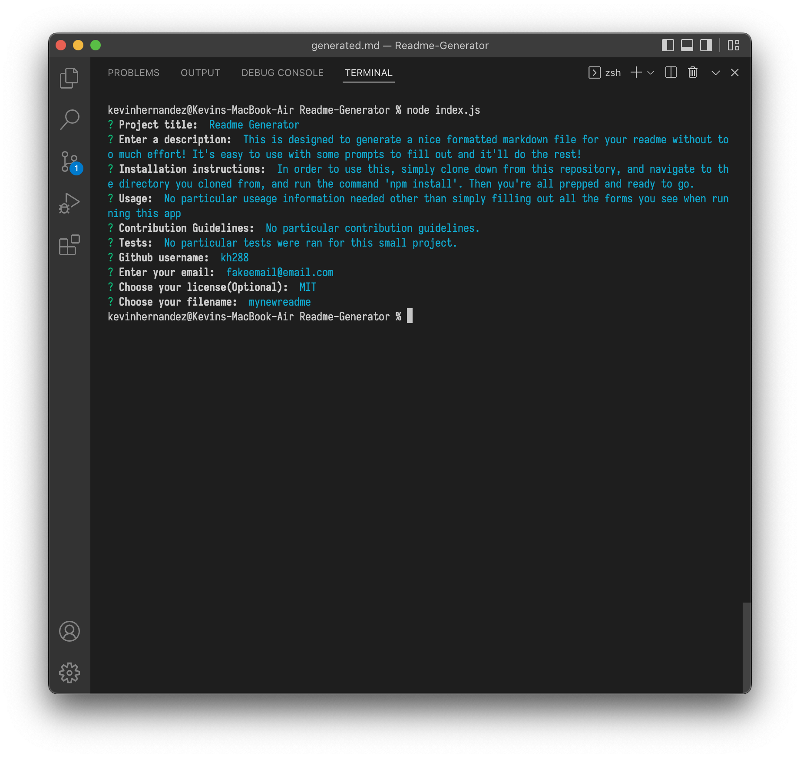
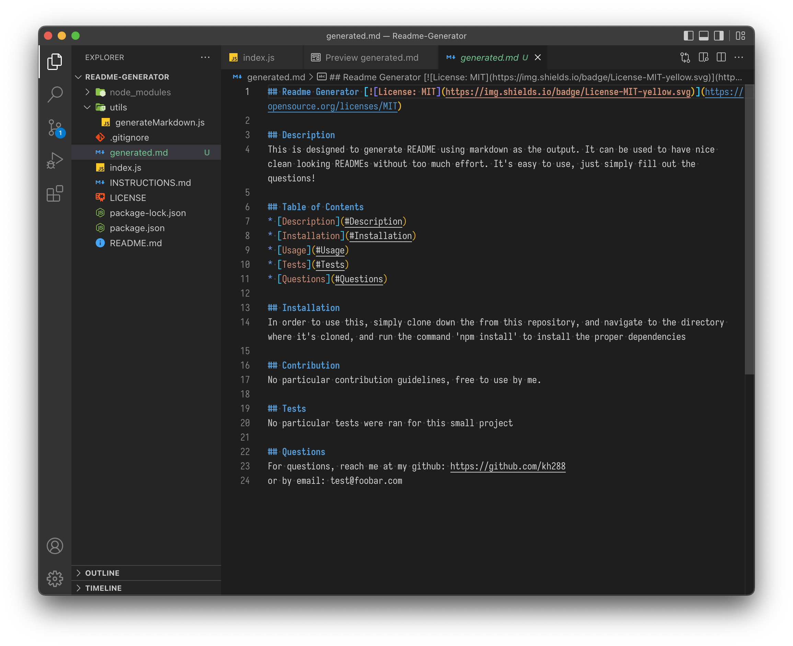

# Readme Generator 

## Description
This is designed to generate README using markdown as the output. It can be used to have nice clean looking READMEs without too much effort. It's easy to use, just simply fill out the questions!

## Table of Contents
* [Description](#description)
* [Installation](#installation)
* [Usage](#usage)
* [Tests](#tests)
* [Questions](#questions)

## Example

## Installation
In order to use this, simply clone down the from this repository, and navigate to the directory where it's cloned, and run the command 'npm install' to install the proper dependencies

## Usage
No particular useage information needed for this particular application, simply fill out the forms and you'll see a generated readme at the end of the prompts!

## Contribution
No particular contribution guidelines, free to use by me.

## Tests
No particular tests were ran for this small project

## Questions
For questions, reach me at my github: https://github.com/kh288